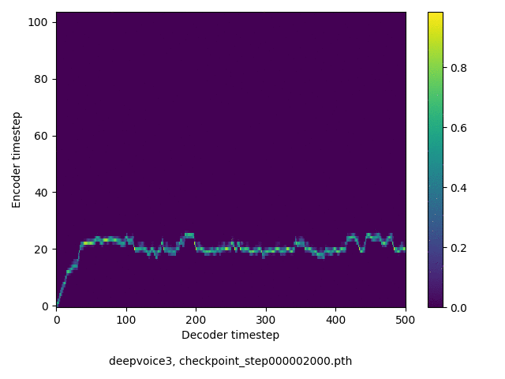

# MAKEDONKA: Text-to-Speech model for Macedonian Language based on Deep Voice 3

## Requirements

 - Python 3.6
 - CUDA >= 8.0
 - PyTorch >= v1.0.0
 - [DeepVoice3] (https://github.com/r9y9/deepvoice3_pytorch)

## MAKEDONKA model
Use the following link to download the model: https://drive.google.com/file/d/1XjxpHhDOG0B1LHO2pVKI_51sSEd_eMvv/view?usp=sharing

### Samples
 - https://f-data.github.io/TTS/

## Attention Alignment
